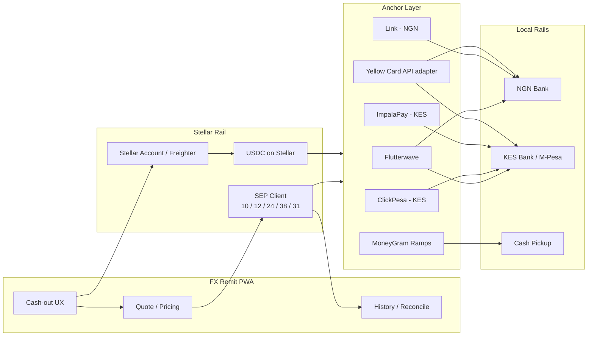
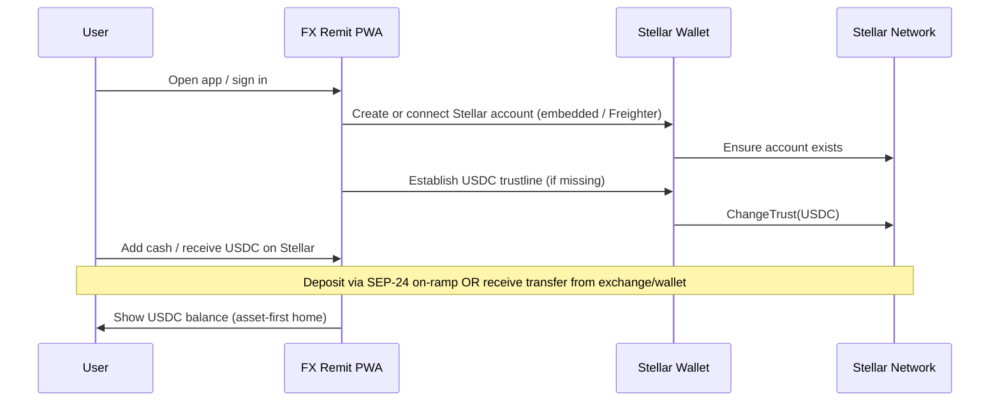
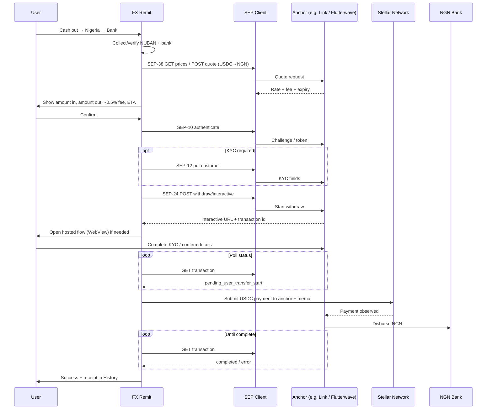
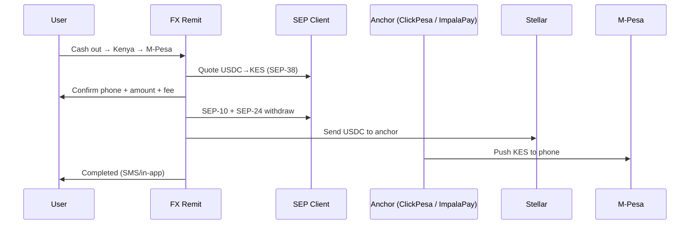
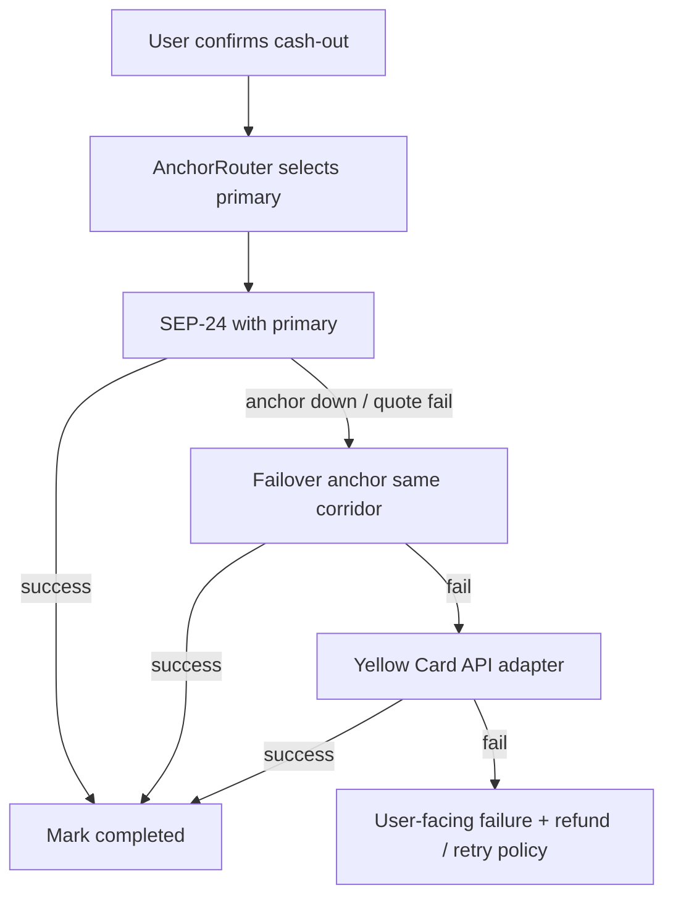

# FX Remit × Stellar Integration Plan

**Purpose:** Technical and product plan for adding Stellar as a remittance and cash-out rail inside FX Remit, alongside the existing EVM path.  
**Audience:** Engineering, product, partners.  
**Status:** In progress — dual-rail design; Stellar package scaffold started.  
**Corridors (MVP):** NGN (Nigeria) + KES (Kenya).  
**Closed beta (EVM):** [Dune — FX Remit](https://dune.com/kanas1/fx-remit) · Repo: [Fx-Remit/Fx-Remit](https://github.com/Fx-Remit/Fx-Remit)

---

## 1. Executive Summary

FX Remit is a non-custodial crypto→fiat remittance PWA for Africa. Users hold stablecoins and cash out to local bank accounts / mobile money at a transparent **~0.5% fee**, targeting a **~2-minute** payout experience.

Today we run on **EVM (Celo / Base)** with Paycrest as the primary offramp. We completed a **closed beta** with verifiable on-chain usage (NGN- and KES-related corridors among others).

**Stellar is not a side feature.** We are adding it as a **primary settlement + cash-out rail** next to EVM:

> User holds **USDC on Stellar** → FX Remit quotes and initiates cash-out → **SEP-compliant anchors** pay out **NGN** or **KES** → status returns into FX Remit history.

We integrate **SEP standards once**, then route to **multiple anchors per corridor** (provider abstraction)the same idea as our existing EVM gateway/adapter model.

Scope for the Stellar work: wallet, SEP client, quotes, cash-out, monitoring, and mainnet for this rail not general marketing or unrelated EVM work.

---


## 2. Why Stellar


| Pain on EVM today                       | What Stellar improves                     |
| --------------------------------------- | ----------------------------------------- |
| Custom offramp APIs per provider        | One SEP client → many anchors             |
| Gas / UX friction for small remittances | Native low-fee USDC payments              |
| Slow corridor expansion                 | Anchor directory + stellar.toml discovery |
| Harder multi-country compliance handoff | SEP-10 / SEP-12 standard KYC auth         |


Cash-out is the core product. Stellar should make that path faster, cheaper, and easier to expand across anchors  not store metadata, badges, or presence-only tokens.

---


## 3. Product Vision on Stellar


### 3.1 User promise

- **Asset-first UX:** user sees “USDC,” not “Stellar vs Celo.”
- **Corridors:** cash out to **Nigeria (NGN bank)** and **Kenya (KES bank / M-Pesa)**.
- **Fee:** transparent **~0.5%** on top of a clear execution rate (SEP-38 quote where supported).
- **Speed:** target the same **~2-minute** completion promise where anchors allow.
- **Trust:** full status in-app (pending → sent → paid out / failed).


### 3.2 Target users (unchanged wedge)

1. Crypto traders cashing USDT/USDC-style balances to local fiat without P2P risk.
2. Freelancers converting stables to local spend (NGN / KES)

---


## 4. High-Level Architecture




### 4.1 Design principle: AnchorAdapter

Mirror the existing EVM “Gateway Selector” pattern:


| Layer                     | Responsibility                                       |
| ------------------------- | ---------------------------------------------------- |
| **PWA / UX**              | Quote, bank/M-Pesa details, confirm, history         |
| **Stellar Wallet Module** | Accounts, trustlines, sign/submit payments           |
| **SEP Client**            | SEP-10, 12, 24, 38 (MVP); SEP-31 (phase 2)           |
| **AnchorRouter**          | Pick best anchor by corridor, fee, liquidity, health |
| **Adapters**              | Per-anchor config (home domain, assets, limits)      |
| **Reconcile**             | Poll / webhook → DB → user history                   |


EVM + Paycrest remains live. Stellar is a **parallel rail**, not a rewrite.

---


## 5. Standards We Will Implement


| SEP              | Role in FX Remit                                               | Phase    |
| ---------------- | -------------------------------------------------------------- | -------- |
| **SEP-10**       | Authenticate Stellar account with anchor                       | MVP      |
| **SEP-12**       | KYC customer info exchange where required                      | MVP      |
| **SEP-24**       | Interactive deposit/withdraw (primary consumer cash-out)       | MVP      |
| **SEP-38**       | RFQ / quotes for USDC → NGN/KES before commit                  | MVP      |
| **SEP-6**        | Optional programmatic deposit/withdraw if an anchor prefers it | Optional |
| **SEP-31**       | Anchor↔anchor programmatic cross-border                        | Phase 2  |
| **stellar.toml** | Discover anchor capabilities, currencies, endpoints            | MVP      |


**Soroban:** only if it does real work (e.g. fee escrow / routing policy). No decorative contracts. Any contracts we add will be open-sourced.

---


## 6. Corridor & Anchor Strategy

Sources: [Stellar Anchor Directory](https://anchors.stellar.org/), partner docs, ecosystem research.  
**Production partners locked after sandbox verification** of SEP support, fees, limits, and SLA.

### 6.1 Nigeria — NGN


| Partner          | Type                               | Fit                         |
| ---------------- | ---------------------------------- | --------------------------- |
| **Link**         | Stellar anchor (NGN listed)        | Primary NGN specialist      |
| **Flutterwave**  | Stellar-listed, multi-country USDC | Dual corridor (NGN + KES)   |
| **Chipper Cash** | Stellar-listed, pan-African        | Consumer reach / redundancy |
| **Yellow Card**  | REST API (not native SEP)          | Adapter for coverage gaps   |
| **Cowrie**       | NGNT / SEP-6 heritage              | Optional / legacy path      |


### 6.2 Kenya — KES


| Partner             | Type                      | Fit                       |
| ------------------- | ------------------------- | ------------------------- |
| **ClickPesa**       | Stellar anchor (KE/TZ/RW) | Primary KES / M-Pesa path |
| **ImpalaPay**       | Stellar anchor (Kenya)    | Redundancy / M-Pesa       |
| **Flutterwave**     | Multi-country             | Shared NGN+KES partner    |
| **MoneyGram Ramps** | SEP-24 cash network       | Unbanked cash pickup      |
| **Yellow Card**     | REST API                  | Adapter / failover        |


### 6.3 Routing policy (initial)

1. User selects corridor (`NGN` or `KES`) + payout method (bank / M-Pesa / cash).
2. `AnchorRouter` scores anchors: SEP-24 available, quote quality (SEP-38), fee, ETA, health, method support.
3. Primary chosen; one failover reserved.
4. If no SEP anchor healthy → optional Yellow Card adapter (same UX, different backend).

---


## 7. Intended User Flows


### 7.1 Flow A — Onboard Stellar + fund USDC




**Acceptance criteria**

- [ ] New user gets a Stellar account without leaving FX Remit (embedded path).
- [ ] Freighter users can connect.
- [ ] USDC trustline is automatic; user never sees raw trustline jargon.
- [ ] Balance appears on home with existing assets.

---


### 7.2 Flow B — Cash out USDC → NGN (bank) via SEP-24




**Acceptance criteria**

- [ ] Quote shown before commit; fee transparent.
- [ ] Failed KYC / failed payout surfaces clear error + support path.
- [ ] History shows Stellar tx hash + anchor tx id + final NGN amount.

---


### 7.3 Flow C — Cash out USDC → KES (M-Pesa) via SEP-24

Same as Flow B with differences:


| Step               | NGN                    | KES                               |
| ------------------ | ---------------------- | --------------------------------- |
| Destination fields | Bank code + NUBAN      | M-Pesa phone and/or bank          |
| Preferred anchors  | Link, Flutterwave      | ClickPesa, ImpalaPay, Flutterwave |
| Payout rail        | Nigerian bank transfer | M-Pesa / Kenyan bank              |
| UX copy            | “Bank account”         | “M-Pesa” primary, bank secondary  |





---


### 7.4 Flow D — Cash pickup (MoneyGram Ramps) — optional corridor method

For unbanked recipients:

1. User selects **Cash pickup**.
2. SEP-24 with **MoneyGram Ramps**.
3. Recipient collects local cash (KES/NGN where enabled) with reference + ID.
4. FX Remit shows reference + instructions in History.

---


### 7.5 Flow E — Failover / multi-anchor




---


### 7.6 Flow F — Phase 2 SEP-31 (programmatic remittance)

After SEP-24 is stable:

1. FX Remit acts as (or partners with) a **sending** client.
2. Creates SEP-31 payment to a **receiving** anchor in NG/KE.
3. Passes customer info via SEP-12; uses SEP-38 quote.
4. Settles USDC on Stellar between anchors.
5. Receiving anchor pays out NGN/KES without interactive WebView when possible.

**Why later:** Requires bilateral anchor agreements and stronger compliance ops. SEP-24 ships value first.

---


## 8. Mapping to Current FX Remit Codebase


| Existing capability                   | Stellar extension                                     |
| ------------------------------------- | ----------------------------------------------------- |
| PWA cash-out screens (`apps/pwa`)     | Corridor picker: Stellar USDC → NGN/KES               |
| Quote / pricing service               | SEP-38 + fee overlay (0.5%)                           |
| Bank verify / institutions            | Keep UX; map fields to SEP-9/12 + anchor forms        |
| Paycrest payout service               | Parallel `StellarAnchorPayoutService`                 |
| History + webhooks + reconcile cron   | Poll SEP-24 tx + optional webhooks                    |
| Provider abstraction (contracts/docs) | `AnchorAdapter` + `AnchorRouter`                      |
| Privy auth                            | Keep app auth; add Stellar key management / Freighter |


**Out of Stellar rail scope:** Delaware Flip, general marketing, pure EVM feature work.

---


## 9. Suggested Package / Module Layout

```
packages/services/src/stellar/
  sep10.client.ts
  sep12.client.ts
  sep24.client.ts
  sep38.client.ts
  sep31.client.ts          # phase 2
  anchor.router.ts
  anchors.config.ts        # home domains, assets, corridors
  stellar.wallet.ts
  reconcile.stellar.ts

apps/pwa/src/
  lib/stellar/
  app/cash-out/stellar/    # or extend existing cash-out routes
```

Config example (illustrative):

```ts
// anchors.config.ts (illustrative — verify before production)
export const ANCHORS = {
  flutterwave: {
    homeDomain: "…", // from stellar.toml
    corridors: ["NGN", "KES"],
    seps: ["SEP-10", "SEP-24", "SEP-38"],
  },
  link: { corridors: ["NGN"], assetHints: ["USDC", "NGN"] },
  clickpesa: { corridors: ["KES"], countries: ["KE", "TZ", "RW"] },
  impalapay: { corridors: ["KES"] },
  moneygram: { methods: ["cash_pickup"], seps: ["SEP-24"] },
};
```

---


## 10. Delivery milestones

Three phases. Final phase = **mainnet** live cash-out.

### Phase 1 — MVP (Testnet / Sandbox)

**Deliverables**

- Stellar account connect/create in PWA
- USDC trustline + balance display
- SEP-10 + SEP-24 + SEP-38 sandbox cash-out
- At least **one** working path for **NGN** and **one** for **KES**
- History entries for Stellar cash-outs
- Architecture diagram + runbook draft

**Done when:** Demo of USDC → NGN and USDC → KES on sandbox.

### Phase 2 — Hardening

**Deliverables**

- Multi-anchor routing + failover
- SEP-12 KYC edge cases
- Fee transparency + quote expiry handling
- Ops: alerting, reconcile job, failure taxonomy
- Metrics: p95 completion time, failure rate, volume by corridor

**Done when:** Soak test; documented SLOs; second anchor per corridor configured.

### Phase 3 — Mainnet Launch

**Deliverables**

- Mainnet USDC + production anchors for NGN & KES
- Public PWA path live
- Open-source plan for any contracts
- Public metrics dashboard (Dune or equivalent for Stellar where possible)
- Launch notes / ops report

**Done when:** Real mainnet cash-outs in both corridors.

---


## 11. Cost focus for the Stellar rail

When budgeting this work:

- Cover Stellar-integrated engineering, QA, and launch ops
- Typical line items: wallet/SEP client, PWA flows, anchor integration, security review, testnet→mainnet, monitoring
- Exclude: token incentives, broad marketing, unrelated EVM refactors, entity formation costs

*(Exact amounts TBD when planning the funded build.)*

---


## 12. Risks & Mitigations


| Risk                                         | Mitigation                                                                  |
| -------------------------------------------- | --------------------------------------------------------------------------- |
| Anchor lists NGN/KES but weak SEP-24 support | Sandbox verify `stellar.toml` + `/info` before locking partner              |
| Single-anchor outage                         | Multi-anchor router + Yellow Card adapter                                   |
| KYC friction kills conversion                | Prefill SEP-9/12; keep interactive SEP-24 only when required                |
| Quote expiry mid-flow                        | Re-quote; clear UX; short confirm path                                      |
| Regulatory / licensing                       | Rely on regulated anchors for fiat; we stay product + Stellar settlement UX |
| Scope creep into Soroban                     | SEP-first; Soroban only if justified                                        |


---


## 13. Success Metrics (Stellar rail)


| Metric                             | Target (directional)                        |
| ---------------------------------- | ------------------------------------------- |
| Time to first sandbox NGN cash-out | Within Phase 1                              |
| Time to first sandbox KES cash-out | Within Phase 1                              |
| Mainnet corridors live             | NGN + KES                                   |
| p95 cash-out completion            | Competitive with “~2 min” where rails allow |
| Failure rate                       | Track & drive down each phase               |
| Unique Stellar cash-out users      | Growth post-mainnet                         |
| Volume (USD) on Stellar rail       | Track in ops / analytics                    |


Existing EVM closed-beta baseline (context, not Stellar): **107 txs · 16 users · ~$2,350 vol** — [Dune](https://dune.com/kanas1/fx-remit).

---


## 13. Where the product stands today

FX Remit already ships remittance on EVM: onboarding, quotes, bank cash-out, and history. A closed beta produced verifiable on-chain activity (NGN/KES corridors among others) see the Dune dashboard above.

We are adding Stellar so the same cash-out experience can settle with native USDC and SEP anchors, while Celo/Base + Paycrest stay live. Users get one app; two rails.

**What this brings to Stellar:** more retail USDC cash-out into African fiat (NGN, KES), more traffic to SEP-compliant anchors, and a dual-rail remittance front-end rather than another isolated wallet.

Next partner steps: sandbox access with Link, ClickPesa, and Flutterwave; Freighter / quote demos as the rail hardens.

---


## 14. Implementation status (incremental build)


| Commit slice                      | Status | Location                                              |
| --------------------------------- | ------ | ----------------------------------------------------- |
| Scaffold (types, anchors, README) | Done   | `packages/services/src/stellar/`                      |
| SEP-10 client + testnet script    | Done   | `sep10.client.ts`, `scripts/sep10-testnet.ts`         |
| Freighter + USDC balance (dev)    | Done   | `apps/pwa/src/lib/stellar/`, `/stellar/dev`           |
| SEP-38 quote API                  | Done   | `GET /api/stellar/quote`                              |
| SEP-24 withdraw start (sandbox)   | Done   | `sep24.client.ts`, `POST /api/stellar/withdraw/start` |
| Prisma rail fields (additive)     | Done   | `schema.prisma` — run `prisma migrate` before use     |


**Enable locally:** `NEXT_PUBLIC_STELLAR_ENABLED=true` · optional `STELLAR_NETWORK=testnet` · `STELLAR_TEST_SECRET` for withdraw API/scripts.

**Still ahead:** unified cash-out confirm, embedded wallet, history merge, mainnet.

---


## 15. Open decisions

- [ ] Confirm Flutterwave / Link / ClickPesa / ImpalaPay **sandbox** access and SEP-24 withdraw for USDC→fiat
- [ ] Confirm MoneyGram Ramps **wallet partnership** requirements (SEP-24 allowlist)
- [ ] Choose embedded Stellar key custody approach (Privy-compatible vs dedicated module)
- [ ] Decide deposit story: SEP-24 on-ramp vs “receive USDC only” for MVP
- [ ] Legal: which entity signs anchor agreements (TopCo vs OpCo)


## 16. References

- [Stellar Anchor Directory](https://anchors.stellar.org/)
- [SEP-24 — Hosted Deposit & Withdrawal](https://developers.stellar.org/docs/build/apps/wallet/sep24)
- [Anchors overview](https://developers.stellar.org/docs/learn/fundamentals/anchors)
- [FX Remit Dune dashboard](https://dune.com/kanas1/fx-remit)
- Internal: `STRATEGY_ROADMAP.md`, `packages/contracts/README.md`

