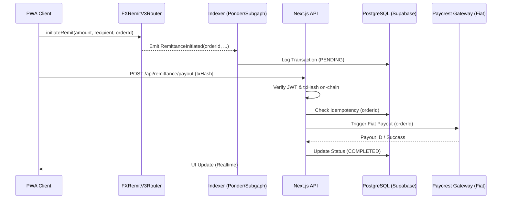

# FX Remittance PWA - Backend Architecture

This document specifies the professional-grade backend architecture for the FX Remittance PWA. It is designed for **high-concurrency** (100+ users), **100% data consistency**, and **secure blockchain synchronization**.

## 1. System Overview

The backend acts as the bridge between **Blockchain Events** (On-Chain) and **Fiat Payouts** (Off-Chain).



## qEKhIj6wv31kAIpa

## 2. Database Schema (Relational PostgreSQL)

We use **Supabase (PostgreSQL)** with connection pooling enabled.

### **Table: `users`**

| Field               | Type    | Constraint  | Description                 |
| :------------------ | :------ | :---------- | :-------------------------- |
| `id`                | UUID    | PK, DEFAULT | Primary Internal ID         |
| `privy_did`         | STRING  | UK, INDEXED | Decentralized ID from Privy |
| `wallet_address`    | STRING  | UK, INDEXED | Primary Embedded Wallet     |
| `full_name`         | STRING  |             | User's Legal Name           |
| `email`             | STRING  | UK          |                             |
| `avatar_url`        | STRING  |             | Optional Profile Image      |
| `total_sent_usd`    | DECIMAL | DEFAULT 0.0 | Aggregated Stats            |
| `transaction_count` | INTEGER | DEFAULT 0   | Aggregated Stats            |

### **Table: `transactions`**

| Field            | Type    | Constraint     | Description                           |
| :--------------- | :------ | :------------- | :------------------------------------ | -------- | --------- | ------ |
| `id`             | UUID    | PK             |                                       |
| `user_id`        | UUID    | FK -> users.id | Owner of the TX                       |
| `order_id`       | INTEGER | UK, INDEXED    | **The Idempotency Key** from Contract |
| `tx_hash`        | STRING  | UK, INDEXED    | On-chain Hash                         |
| `source_token`   | STRING  |                | USDC / cUSD address                   |
| `amount_usd`     | DECIMAL |                | Amount Swapped                        |
| `payout_fiat`    | DECIMAL |                | Amount to Bank                        |
| `status`         | ENUM    |                | PENDING                               | VERIFIED | COMPLETED | FAILED |
| `recipient_name` | STRING  |                |                                       |
| `recipient_bank` | STRING  |                | Bank Code (Paycrest)                  |
| `recipient_acc`  | STRING  |                | Account Number                        |

---

## 3. The Remittance Sync Engine 🏗️🔗⛓️

To ensure 100% reliability, the backend uses a **Hybrid Sync Tier**:

### **A. The Real-time Hook**

- **Trigger**: Alchemy/Moralis Webhook on the `RemittanceInitiated` event.
- **Goal**: Immediate UI updates and DB record creation.

### **B. The Indexer (State Guard)**

- **Tool**: Separate package `apps/indexer` (using Ponder).
- **Goal**: Maintains a mirrored state of all contract events. If a user closes the app mid-transaction, the Indexer detects the event, sees the record is missing in the primary DB, and triggers the completion logic.

---

## 4. Concurrency & Security Strategy 🛡️🛡️🛡️

### **Idempotency Strategy**

- **Problem**: Multi-tapping or network retries might trigger double payouts.
- **Solution**: The `order_id` emitted by the blockchain is used as a **DB unique constraint**. Any duplicate attempt to log or payout based on the same `order_id` is automatically rejected at the database level.

### **Privy Verification**

- Every API request must include a `Bearer` token (Privy Access Token).
- The backend verifies the token using `privy.verifyAccessToken()`.
- The `did` extracted from the token is used to query the `users` table, ensuring **Zero-Trust Cross-User data access**.

### **Scaling**

- **Horizontal**: Next.js API Routes (Serverless) scale to thousands of users.
- **DB Stability**: **Supavisor** (Connection Pooler) handles 100+ concurrent DB connections seamlessly.

---

## 5. Paycrest / Payrest Integration Logic 💳

1.  **Payout Call**: `POST /v1/payout`
2.  **Auth**: Backend uses a server-side `PAYCREST_SECRET_KEY`.
3.  **Payload**:
    ```json
    {
      "external_id": "ORDER_ID_FROM_CONTRACT",
      "currency": "NGN",
      "amount": 150000,
      "beneficiary": { ... bank details ... }
    }
    ```
4.  **Webhooks**: Paycrest hits our `/api/webhooks/paycrest` when the bank confirms the transfer. We then push a notification to the user via **Firebase Cloud Messaging**.
