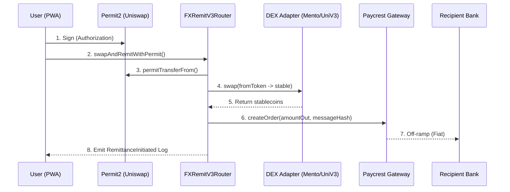

# FX Remit 2.0 Smart Contracts

**Non-Custodial, Multi-Chain, Stateless Remittance Protocol**

This package contains the core smart contracts for FX Remit 2.0, enabling users to swap any native token (ETH, CELO, MATIC) into stablecoins and remit them to a fiat bank account in a single transaction.

---

## 1. Architecture Flow

The protocol follows a stateless routing pattern. High-level Overview:



---

## 2. Key Components

### `FXRemitV3Router.sol`

The central orchestrator. It manages:

- **Permit2 Integration**: Enables "Sign & Send" for a single-click UX.
- **Registry**: Maps tokens to their respective DEX adapters.
- **Security**: Optimized with `ReentrancyGuard` and `Custom Errors`.

### `ISwapAdapter.sol` & Its Implementations

A plugin-based system to support different liquidity sources per chain:

- **`UniswapV3Adapter.sol`**: Deployed on **Base** and **Polygon**. Handles V3 liquidity pools.
- **`MentoAdapter.sol`**: Deployed on **Celo**. Handles native cUSD/cEUR stable swaps via the Mento Broker.

### `IPaycrestGateway.sol` (Gateway)

The exit point. Transfers stablecoins to the Paycrest contract and provides the metadata needed for off-chain bank transfers.

---

## 3. Administrative Functions

The following functions are restricted to the `onlyOwner` (Admin) address:

| Function       | Description                                     |
| :------------- | :---------------------------------------------- |
| `setGateway`   | Update the Paycrest Gateway address.            |
| `setAdapter`   | Map a source token to a specific DEX adapter.   |
| `setFeeConfig` | Configure partner fee address and bps (Max 2%). |
| `rescueTokens` | Recover accidentally sent ERC20 tokens.         |

---

## 4. Developer Conventions

### Native Asset Support

To remit native assets (ETH, CELO), use `address(0)` as the `fromToken`. The router will automatically wrap the `msg.value` into its W-equivalent (WETH/WCELO).

### Basis Points (bps)

All fees are handled in basis points. `100 bps = 1%`. The default configuration is `50 bps` (0.5%).

### Remittance Parameters (`RemitParams`)

When calling the router, use the following struct:

```solidity
struct RemitParams {
    address fromToken;      // Token to swap (or address(0) for Native)
    uint256 amountIn;       // Amount to swap
    uint256 minAmountOut;   // Slippage Protection (Min Stablecoins to receive)
    string targetCurrency;  // Destination Currency (e.g., "NGN")
    bytes32 messageHash;    // Encrypted Recipient Metadata
    uint256 rate;           // Expected FX Rate (Provided by Paycrest)
    string providerId;      // Internal Tracking ID
}
```

> [!IMPORTANT]
> **Slippage Protection**: Always set a realistic `minAmountOut`. If the DEX swap results in fewer tokens than this value, the entire transaction will revert to protect the user's funds.

---

## 5. Observability (Dune Analytics)

Every successful remittance emits the `RemittanceInitiated` event. This is the source of truth for all metrics:

```solidity
event RemittanceInitiated(
    uint256 indexed orderId,      // Paycrest Tracking ID
    address indexed sender,       // User Wallet
    address fromToken,            // Source Asset
    address toToken,              // Exit Stablecoin
    uint256 amountIn,             // Input Amount
    uint256 amountOut,            // Output Amount
    uint256 sourceChainId,        // Network Visibility
    string targetCurrency,        // Corridor (NGN, KES, BRL)
    string providerId             // Tracking
);
```

---

## 6. Development & Testing

Built with **Foundry** for speed and coverage.

### Commands

---

## 8. Deployment Guide

The protocol uses **Foundry** for all production deployments. The `DeployFXRemit.s.sol` script automatically resolves chain-specific addresses.

### 1. Configure Environment

Create a `.env` file based on `.env.example`:

```bash
PRIVATE_KEY=your_key
# RPCs
BASE_RPC_URL=https://mainnet.base.org
ARB_RPC_URL=https://arb1.arbitrum.io/rpc
CELO_RPC_URL=https://forno.celo.org
# API Keys
BASESCAN_API_KEY=your_key
ARBISCAN_API_KEY=your_key
CELOSCAN_API_KEY=your_key
```

### 2. Deploy to Celo (Mainnet)

```bash
source .env
forge script script/DeployFXRemit.s.sol:DeployFXRemit \
  --rpc-url $CELO_RPC_URL --private-key $PRIVATE_KEY \
  --broadcast --verify --etherscan-api-key $CELOSCAN_API_KEY
```

### 3. Deploy to Arbitrum One

```bash
source .env
forge script script/DeployFXRemit.s.sol:DeployFXRemit \
  --rpc-url $ARB_RPC_URL --private-key $PRIVATE_KEY \
  --broadcast --verify --etherscan-api-key $ARBISCAN_API_KEY --legacy
```

### 4. Deploy to Base Mainnet

```bash
source .env
forge script script/DeployFXRemit.s.sol:DeployFXRemit \
  --rpc-url $BASE_RPC_URL --private-key $PRIVATE_KEY \
  --broadcast --verify --etherscan-api-key $BASESCAN_API_KEY
```

---

## 9. Deployed Addresses

### Celo Mainnet (Live)

- **Router**: `0x767B35703C98f63e71aB61d68a406931ADdb3FeB`
- **MentoAdapter**: `0x077fCc25199a5d8016102a2f706dC63BA0d6700e`

### Arbitrum One / Base (Pending)

_To be added after deployment._

---

## 10. Security and Audit

The Fx-Remit contracts have been rigorously audited using advanced security methodologies.

- **[Full Audit Report](AUDIT_REPORT.md)** - Detailed vulnerability assessment and architectural review.

### Core Security Principles

1. **Statelessness**: The router does not hold long-term balances, minimizing "honey-pot" risk.
2. **Reentrancy Guard**: Every state-changing entry point is protected by OpenZeppelin's `ReentrancyGuard`.
3. **Hard-Capped Fees**: Partner fees are strictly capped at **2% (200 bps)** in the smart contract code to prevent operational errors.
4. **Rescue Mechanism**: Contract includes a `rescueTokens` function for the owner to recover funds in edge cases.
5. **Permit2 Compliance**: Secure, signature-based token transfers with built-in replay protection.

---

© 2026 FX Remit. All rights reserved.
